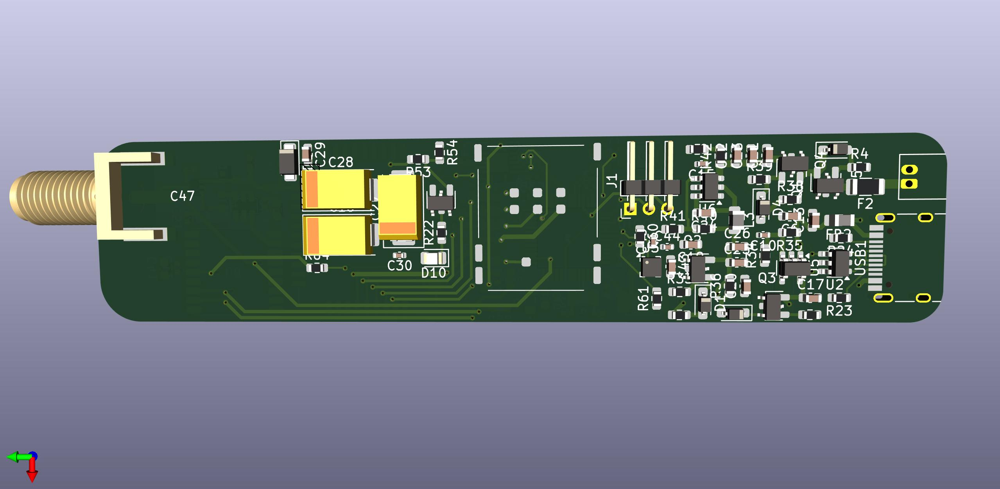
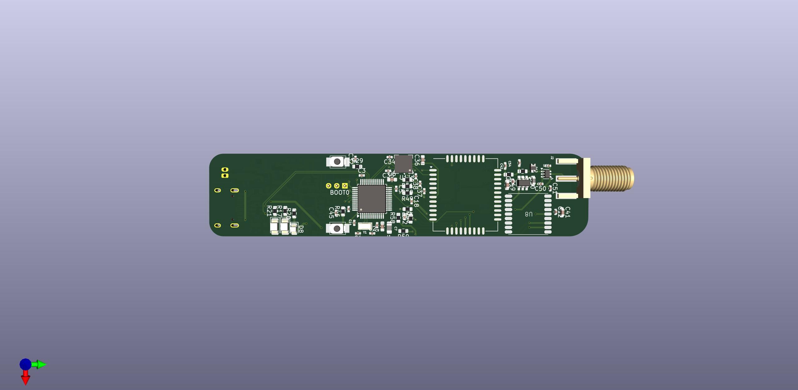
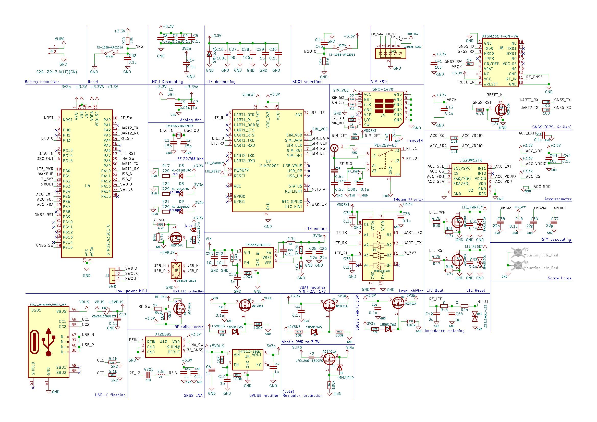

# Low power LTE & GNSS anti-theft tracker

This project contains hardware design files, including schematics and PCB layouts created by Deniel.  
It is shared for educational and personal use purposes only. Commercial use is not permitted without written permission.

## Preview

The previews of the PCB design and schematic:

>  Note: The project is ongoing
> 1. Current schematic revision v0.3
> 2. Current PCB revision v0.1

## Description
Very compact __(20mm x 90mm)__ LTE modem designed to be used as anti-theft geolocation tracker to be mounted inside bicycles, moto, scooters etc. The UDP server and client to be setup and installed.

## Main Hardware
- MCU: STM32L433CCT6
- LTE: SIM7020**E**
- GNSS: ATGM336H-6N-74

## Notes for You
1. The design is still in Alpha state. New updates and revisions coming.
2. Firmware to be developed and tested as well as remote UDP server.
3. Real life Antenna test and adjustments needed, impedance matching has to be tuned (footprints are present).
4. Includes Design Rules errors due to **extreme size constraints**, take that in mind evaluating/redesigning the PCB. Keep width <25mm. 
5. All parts' datasheets have been analyzed. 
6. All parts are in stock on jlcpcb.com (except SIM7020E, but available on aliexpress for 9$+shipping).
7. Many drafts schematics are included in backups for you to see. Many failed because of incompatibility.

## License
This project is provided under a custom license based on the MIT License.  
Commercial use is prohibited. See the [LICENSE](./LICENSE) file for full details.

---

**Copyright © 2025 Deniel A.**
